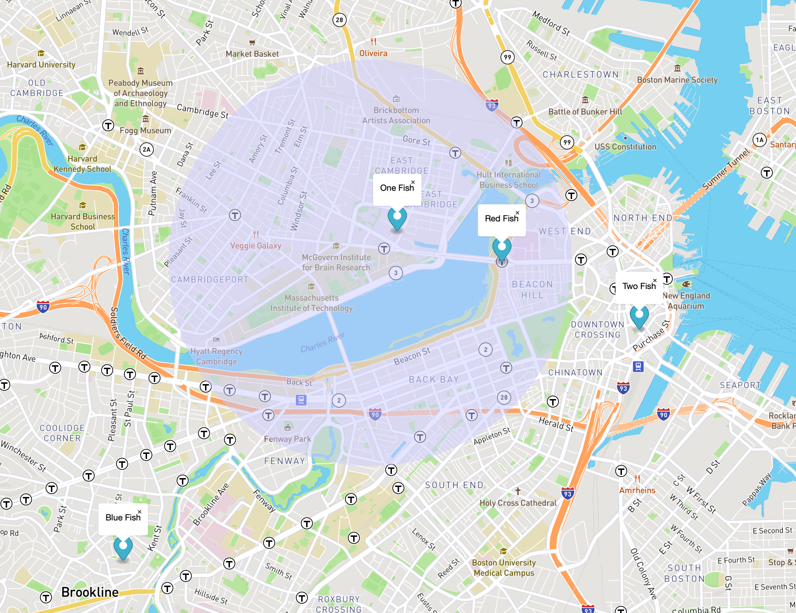

# arrive-backend

This is the postgres based backend for the Arrive mobile apps. It centralizes the logic although in time
the intention is to decentralize the logic into the clients.

## Prerequisites

The following are required. You'll need to install all of this to make this work.

* node.js
* Postgres
* PostGIS

## Setup

Install node packages:
```
npm install
```

Install `db-migrate` globally so migrations can be run from the command line:
```
npm install -g db-migrate
```

Create the database user: (superuser permissions are necessary to add the pgcrypto extension in the first migration but may be revoked later with `ALTER ROLE arrive nosuperuser;`)
```
create user arrive with password 'super-secret-password' superuser;
```

Edit `database.json` to taste.

Set environment variables for passwords you intend to use: (it might be handy to keep this in a file you source - git will ignore a file called `.env`)
```
export ADMIN_PASSWORD="super-secret-password"` # this password is only used in the next step to create the databases
export DEV_PASSWORD="super-secret-password"
export TEST_PASSWORD="super-secret-password"
export PROD_PASSWORD="super-secret-password"
```

Create databases: (you usually don't need all of these on one system!)
```
db-migrate db:create arrive_dev -e bootstrap
db-migrate db:create arrive_test -e bootstrap
db-migrate db:create arrive_prod -e bootstrap
```

Bring database schema to the current version: (run all migrations that haven't yet been run) This defaults to the dev environment.
```
db-migrate up
```

## Test Data

You can add test data by using:
```
db-migrate up:test
```

And remove it with:
```
db-migrate down:test
```

Given the test data, you can see what users are within 2000 meters of a particular point with:
```SQL
SELECT
  first_name,
  last_name,
  ST_X(location::geometry) AS long,
  ST_Y(location::geometry) AS lat
FROM users
WHERE ST_DWithin(location, ST_MakePoint(42.361092, -71.087366)::geography, 2000);
```

This should return two users, `One Fish` and `Red Fish`. Here's what this all looks like on a map:



## API Documentation
There is separate [documentation for the API](API.md).

## Running

To run the application, make sure all the environment variables in [config/index.js](config/index.js) are set and run `node app`
in the root directory. One way you might do this is to use `chpst` to set the variables from files in the `env/`
directory like this:

```
chpst -e env/ node app
```

If all goes well, you should be able to make the `curl` requests in the API documentation on localhost port 3000.
(or whatever you set the port to)
